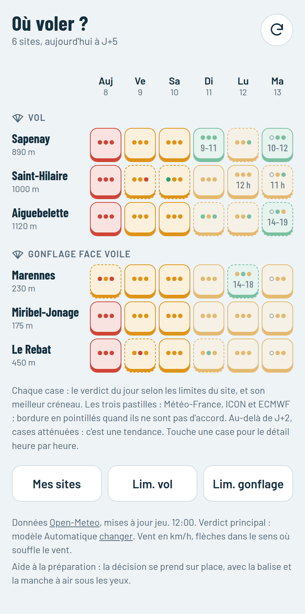
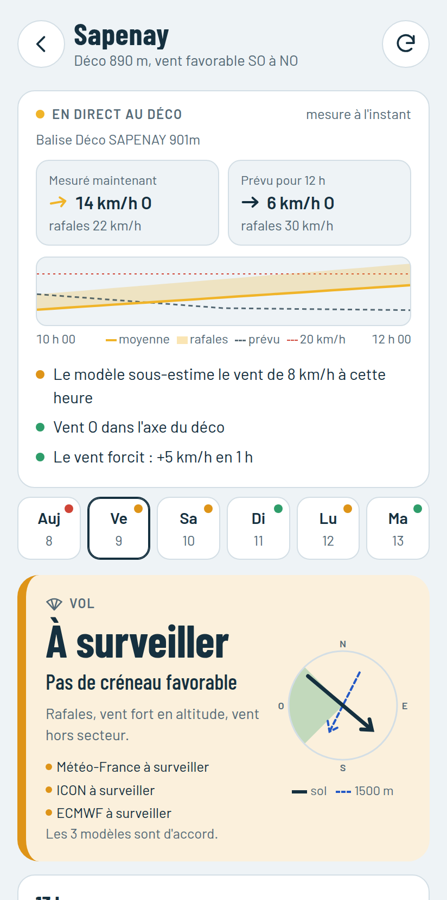

# Déco

**Conditions de vol et de gonflage en parapente, site par site, d'aujourd'hui à J+5.**

Déco est une application web installable (PWA) qui croise les prévisions de trois
modèles météo avec vos limites de pilote, et les confronte en direct aux balises
installées sur les sites. Sans compte, sans serveur, sans publicité : tout tourne
sur le téléphone.

**→ https://ljouglar.github.io/deco/**

<p>
  
  
</p>

> **Avertissement.** Déco est une aide à la préparation, un indicateur de tendance.
> Le verdict dit si les conditions *prévues* restent dans vos limites ; il ne dit pas
> si vous pouvez voler. La décision se prend sur place, avec la balise, la manche à
> air, l'avis des pilotes présents et celui de votre moniteur.

## Sommaire

- [Fonctionnalités](#fonctionnalités)
- [Installer et utiliser](#installer-et-utiliser)
- [Comment Déco juge les conditions](#comment-déco-juge-les-conditions)
- [La balise en direct](#la-balise-en-direct)
- [Hors ligne et réseau faible](#hors-ligne-et-réseau-faible)
- [Données, confidentialité et licences](#données-confidentialité-et-licences)
- [Développement](#développement)
- [Sites préréglés](#sites-préréglés)
- [Licence](#licence)

## Fonctionnalités

- **Où voler ?** : un tableau de tous vos sites, une case par jour, colorée selon le
  verdict et portant le meilleur créneau.
- **Vol et gonflage** : chaque site est un déco ou un terrain de gonflage face
  voile, jugé avec ses propres règles et ses propres limites.
- **Trois modèles comparés** : Météo-France (AROME/ARPEGE), ICON et ECMWF ; un vert
  qu'un seul modèle annonce se repère d'un coup d'œil.
- **Balise en direct** : la mesure du moment face à la prévision, et la tendance des
  deux dernières heures (le vent forcit, faiblit, tourne).
- **Limites par niveau** : repères débutant, intermédiaire et confirmé, entièrement
  réglables.
- **Ajout de sites en deux gestes** : les décos autour de soi ou par leur nom
  (base ParaglidingEarth), avec la balise la plus proche.
- **Hors ligne** : l'appli s'ouvre sans réseau et tient avec une 3G faible.
- **Vos données restent chez vous** : rien n'est envoyé nulle part ; export et import
  des sites pour changer de téléphone.

## Installer et utiliser

### Installation

Ouvrir https://ljouglar.github.io/deco/ puis :

- **Android (Chrome)** : menu ⋮ > « Installer l'application » (ou « Ajouter à l'écran d'accueil ») ;
- **iPhone (Safari)** : bouton Partager > « Sur l'écran d'accueil ».

L'appli est développée et testée sur Android avec Chrome.

### Premier lancement

Sans site enregistré, l'appli propose :

- **Décos autour de moi** : les 12 décos connus les plus proches, à moins de 60 km ;
- **Chercher un déco par son nom** (accents et majuscules ignorés) ;
- **Saisir un site à la main**, notamment pour un terrain de gonflage, absent de la
  base des décos ;
- **Importer des sites exportés** depuis un autre téléphone.

Dans les résultats, « Ajouter » enregistre le déco tout de suite ; toucher son nom
remplit le formulaire pour vérifier l'altitude et le secteur avant d'enregistrer.

### Le tableau « Où voler ? »

L'écran d'accueil : une ligne par site (vol, puis gonflage), une colonne par jour.

- **Couleur** : verdict du jour selon les limites du site ; le créneau favorable le
  plus long est indiqué dans la case (« 10–16 »).
- **Trois pastilles** : le verdict de Météo-France, d'ICON et d'ECMWF ; **bordure en
  pointillés** quand ils ne sont pas d'accord.
- **Cases atténuées** au-delà de J+2 : c'est une tendance.
- **« · »** : le modèle ne couvre pas ce jour ; **« – »** : la journée est terminée.

Toucher une case ouvre l'écran du site sur ce jour.

### L'écran d'un site

De haut en bas : la balise en direct (si le site en a une), les jours, le verdict
avec la rose des vents et le verdict de chaque modèle, le détail de l'heure choisie
(dont le vent selon chaque modèle), puis la liste des heures.

### Réglages

- **Mes sites** : ajouter, modifier, supprimer ; exporter et importer.
- **Mes limites** (ou « Lim. vol » / « Lim. gonflage » depuis le tableau) : un
  niveau en un geste, puis chaque seuil à la main.
- **Modèle météo** (« changer », en pied de page) : le modèle du verdict principal,
  pour tous les sites. Les trois autres restent toujours comparés.

## Comment Déco juge les conditions

Chaque heure entre 7 h et 20 h reçoit un niveau : **favorable**, **à surveiller** ou
**défavorable**. Le jour est favorable s'il offre au moins deux heures favorables
d'affilée dans votre journée (9 h – 18 h par défaut), à surveiller s'il reste des
heures jouables, défavorable sinon. Pour aujourd'hui, seules les heures restantes
comptent.

### Au déco

| Critère | À surveiller | Défavorable |
| --- | --- | --- |
| Pluie | probabilité ≥ 30 % | ≥ 60 % ou ≥ 0,3 mm |
| Direction | travers (≤ 30° hors secteur) | hors secteur : déco sous le vent possible |
| Vent moyen | > 80 % de la limite | > limite |
| Rafales | écart rafales / vent > limite | > limite |
| Vent vers 1500 m | > 75 % de la limite | > limite |
| Flux de sud vers 3000 m | ≥ 25 km/h (foehn) | ≥ 40 km/h |
| Instabilité (CAPE) | ≥ seuil de vigilance | ≥ seuil d'orage |
| Base des nuages (nuages bas ≥ 50 %) | sous le minimum | à moins de 200 m du déco |

Sous 6 km/h de vent météo, la direction n'est pas jugée : la brise de pente devrait
s'installer.

### Sur un terrain de gonflage (face voile)

| Critère | À surveiller | Défavorable |
| --- | --- | --- |
| Vent moyen | sous le minimum (face voile laborieux) ou > 85 % du maximum | > maximum (on se fait traîner) |
| Rafales | écart rafales / vent > limite | > limite |
| Direction | travers, ou hors secteur (turbulences d'obstacles) | – |
| Pluie, instabilité | comme au déco | comme au déco |
| Vent vers 1500 m | > limite (rafales possibles au sol) | – |

Le secteur d'un terrain, ce sont les directions d'où le vent arrive sans passer par
des haies ou des arbres. La base des nuages ne compte pas.

### Repères par niveau

Indicatifs, à ajuster avec son moniteur. Le seuil d'orage (CAPE 1000 J/kg) ne
dépend pas du pilote et reste le même à tous les niveaux.

| Vol | Débutant | Intermédiaire | Confirmé |
| --- | --- | --- | --- |
| Vent moyen max (km/h) | 20 | 25 | 30 |
| Rafales max (km/h) | 25 | 30 | 35 |
| Écart rafales / vent (km/h) | 10 | 12 | 15 |
| Vent vers 1500 m (km/h) | 25 | 30 | 40 |
| CAPE vigilance (J/kg) | 400 | 600 | 800 |
| Base des nuages mini (m au-dessus du déco) | 500 | 400 | 300 |

| Gonflage | Débutant | Intermédiaire | Confirmé |
| --- | --- | --- | --- |
| Vent moyen mini (km/h) | 8 | 6 | 5 |
| Vent moyen max (km/h) | 20 | 25 | 30 |
| Rafales max (km/h) | 25 | 30 | 35 |
| Écart rafales / vent (km/h) | 8 | 10 | 12 |
| Vent vers 1500 m (km/h) | 35 | 40 | 45 |
| CAPE vigilance (J/kg) | 300 | 500 | 700 |

### Accord entre modèles

Le verdict principal suit le modèle choisi (« Automatique » par défaut). Météo-France,
ICON et ECMWF sont évalués en plus, avec les mêmes règles et les mêmes limites.
L'accord renforce la confiance sans la garantir : les modèles partagent une partie
de leurs observations et ratent souvent les mêmes effets locaux (brise de lac,
confluence, foehn).

Météo-France s'arrête vers J+4 en début d'après-midi et ne fournit pas la
probabilité de pluie : il ne voit la pluie qu'à sa quantité prévue.

## La balise en direct

Un site peut être associé à une balise **Pioupiou / OpenWindMap** (son numéro figure
dans l'adresse de la station sur [openwindmap.org](https://www.openwindmap.org/),
par exemple `PIOU_1446`). L'écran du site affiche alors :

- la mesure du moment face à la prévision de la même heure, et ce que l'écart dit du
  modèle (« le modèle sous-estime le vent de 8 km/h à cette heure ») ;
- une courbe des deux dernières heures : vent moyen, rafales, prévision et votre
  limite ;
- la tendance, en comparant les 20 dernières minutes à la même durée une heure plus
  tôt : le vent forcit (avec alerte si la limite peut être atteinte dans l'heure),
  faiblit ou reste stable ; la direction tourne, vers l'axe ou hors de l'axe ; les
  rafales deviennent plus irrégulières.

La mesure est rafraîchie toutes les 4 minutes tant que l'appli est ouverte, et
signalée trop ancienne au-delà de 45 minutes. Sous 3 km/h, la direction n'est pas
interprétée. Une balise reste un point : abritée ou prise dans une brise locale,
elle peut ne pas représenter tout le site.

## Hors ligne et réseau faible

- **Hors ligne** : l'appli s'ouvre depuis le cache de son service worker, et chaque
  site affiche sa dernière prévision enregistrée.
- **Réseau faible** : chaque appel à Open-Meteo ou à une balise abandonne au bout de
  8 s ; l'appli affiche alors « Réseau trop lent » et les prévisions enregistrées.
  La page elle-même est servie depuis le cache si le réseau ne répond pas en 3 s.
  Mesuré avec 10 s par réponse : l'appli installée s'ouvre en 3 s, contre 40 s sans
  service worker.

## Données, confidentialité et licences

### Confidentialité

Déco n'a ni serveur ni compte, et ne collecte rien. Vos sites, notes et limites
restent dans le stockage du navigateur ; l'appli demande qu'il ne soit pas effacé
quand le téléphone manque de place. **Mes sites > Exporter** produit un fichier
`deco-sites-AAAA-MM-JJ.json` à réimporter sur un autre appareil. Les seuls appels
réseau vont vers Open-Meteo (les coordonnées de vos sites) et Pioupiou. La position
n'est demandée que sur action : « Décos autour de moi » la garde sur le téléphone,
« Ma position » l'envoie à Open-Meteo pour obtenir l'altitude.

### Sources de données

| Données | Source | Licence |
| --- | --- | --- |
| Prévisions | [Open-Meteo](https://open-meteo.com/) | CC BY 4.0, usage non commercial gratuit |
| Mesures des balises | [OpenWindMap / Pioupiou](https://www.openwindmap.org/) | © contributeurs du réseau OpenWindMap, [conditions](https://developers.pioupiou.fr/data-licensing) |
| Liste des décos | [ParaglidingEarth](https://www.paraglidingearth.com/) | CC BY-SA 3.0 |
| Polices Barlow et Barlow Condensed | [The Barlow Project](https://github.com/jpt/barlow) | SIL Open Font License 1.1 (`fonts/OFL.txt`) |

## Développement

Sans dépendance ni outil de compilation : HTML, CSS et modules ES natifs.

### Lancer en local

```sh
python3 -m http.server 8000
```

puis ouvrir http://localhost:8000 dans Chrome (outils de développement > mode
appareil pour simuler un téléphone). Sur `localhost`, le service worker passe
toujours par le réseau : chaque rechargement voit les modifications.

### Structure

```
index.html            structure de la page et politique de sécurité (CSP)
style.css             feuille de style, rangée par composant, thèmes clair et sombre
js/                   modules ES, chargés depuis main.js
sw.js                 service worker : cache de l'appli, ouverture hors ligne
manifest.webmanifest  installation (icônes dans icons/, captures dans screenshots/)
fonts/                polices Barlow, servies par le site
sites-fr.json         instantané des décos ParaglidingEarth (recherche par nom)
tools/                vérificateur, banc d'essai, mise à jour de sites-fr.json
```

Les modules dépendent les uns des autres dans un seul sens, sans boucle :

```
outils → config → etat → regles → donnees → balise → rendu → chargement → feuilles → main
```

| Module | Rôle |
| --- | --- |
| `outils.js` | aides sans état : DOM, texte, vent, distances, stockage, `fetchT` (délai réseau) |
| `config.js` | sites préréglés, limites et niveaux, modèles, `KINDS` (déco ou terrain) |
| `etat.js` | état de l'appli (`state`), préréglages, stockage persistant |
| `regles.js` | évaluation heure par heure, verdict du jour, accord des modèles ; ni DOM ni réseau |
| `donnees.js` | prévisions Open-Meteo et cache local |
| `balise.js` | balise Pioupiou : mesure, historique, tendance, bloc « En direct » |
| `rendu.js` | en-tête, tableau, écran d'un site, pied de page |
| `chargement.js` | chargements et navigation : seul le chargement le plus récent s'applique |
| `feuilles.js` | limites, modèle météo, mes sites, sauvegarde, recherche de décos |
| `main.js` | événements de l'écran principal et démarrage |

### Où modifier quoi

| Pour changer… | Voir |
| --- | --- |
| les règles de jugement | `evaluate()`, `evaluateGonflage()` et les règles communes (`flagRain`, `flagGusts`, `flagCape`, `dirNote`) dans `regles.js` |
| le verdict du jour, l'accord des modèles | `dayVerdict()`, `buildDays()`, `buildAll()` dans `regles.js` |
| les limites par défaut, les niveaux | `DEFAULT_LIMITS`, `DEFAULT_LIMITS_G`, `LEVELS_VOL`, `LEVELS_G` dans `config.js` |
| les libellés et phrases propres à un type de site | `KINDS` dans `config.js` |
| l'horizon, les variables demandées | `FORECAST_DAYS`, `HOURLY` ([liste Open-Meteo](https://open-meteo.com/en/docs)) dans `config.js` |
| la lecture de la balise | `liveNotes()`, `liveTrend()`, `trendSvg()` dans `balise.js` |
| le tableau, l'écran d'un site | `renderOverview()`, `render()` et ses parties dans `rendu.js` |

Depuis la console (ou une page de contrôle), l'état et la navigation sont exposés
dans `window.deco` : `state`, `site`, `load`, `loadOverview`, `openSite`, `refresh`.

### Vérifier avant de commiter

```sh
tools/verifier.sh                # tous les contrôles (environ une minute)
tools/verifier.sh --accepter     # une règle a changé exprès : met à jour la référence
tools/verifier.sh --lighthouse   # ajoute un audit Lighthouse (seuil 90 par catégorie)
```

Sans framework : un serveur local, Chrome sans fenêtre et un banc d'essai
(`tools/banc.html`) où l'appli tourne avec un réseau et une heure simulés
(prévision figée `tools/prevision-figee.json`, heure figée à midi, balise simulée).
Il contrôle :

- **les verdicts** des six sites, heure par heure, comparés à `tools/attendu.txt` ;
  après `--accepter`, `git diff tools/attendu.txt` montre quels sites, jours et
  heures basculent, et pourquoi ;
- **un parcours complet** sans erreur JS ni violation de la CSP : tableau, écran d'un
  site, balise, limites, modèle météo, recherche et ajout de sites, export et
  import, suppression jusqu'à l'accueil ;
- **le réseau lent** : Open-Meteo ne répond plus, l'appli doit retomber sur le cache ;
- **le service worker** : chaque fichier de l'appli figure dans `SHELL`, et `CACHE`
  a changé si l'appli a changé depuis le dernier commit.

Le banc s'ouvre aussi à la main, en local uniquement :
http://localhost:8000/tools/banc.html#parcours (ou `#lent`, `#tableau`, `#deco`…).
Il efface le stockage local de `localhost`.

### Publier une nouvelle version

L'appli est servie par GitHub Pages depuis la branche `main` (racine) : un push la
publie en une minute environ.

1. Incrémenter `CACHE` dans `sw.js`, sans quoi les téléphones gardent l'ancienne
   version ; ajouter tout nouveau fichier à `SHELL`, sans quoi l'appli ne s'ouvre
   plus hors ligne. Le vérificateur contrôle les deux.
2. Lancer `tools/verifier.sh`, commiter, pousser.
3. Sur le téléphone, fermer puis rouvrir l'appli (parfois deux fois).

### Mettre à jour la liste des décos

L'API ParaglidingEarth n'a ni recherche par nom ni en-têtes CORS : la liste est
embarquée (`sites-fr.json`, environ 60 Ko) et se régénère avec :

```sh
python3 tools/pge_snapshot.py            # France
python3 tools/pge_snapshot.py fr ch it   # plusieurs pays
```

puis incrémenter `CACHE`. Le secteur d'un déco ajouté est tiré de ses orientations
**principales** seulement (les orientations « possibles » sont souvent très larges) ;
les autres sont reprises dans sa note.

## Sites préréglés

Les sites de l'auteur, livrés aux seuls téléphones qui avaient déjà des sites
enregistrés, une seule fois chacun : un site supprimé ne revient pas, et les
réglages ne sont jamais écrasés. Un nouveau téléphone démarre sans site.

| Site | Type | Altitude | Secteur | Balise |
| --- | --- | --- | --- | --- |
| Sapenay | déco | 890 m | SO à NO (225–315°) | 1446 – Déco SAPENAY 901m |
| Saint-Hilaire | déco | 1000 m | NE à SE (45–135°) | 1333 – Décollage A5 / déco Nord |
| Aiguebelette | déco | 1120 m | SSO à NO (200–315°) | 1722 – Déco Aiguebelette 1121m |
| Marennes | gonflage | 230 m | NO à NE (315–45°), pente école face nord | 2229 – Pente Ecole MARENNES |
| Miribel-Jonage | gonflage | 175 m | SE à SO (135–225°), champ plat | aucune à moins de 15 km |
| Le Rebat (Poleymieux) | gonflage | 450 m | ONO à NNE (285–15°), pente école face NNO | aucune en service |

- À Sapenay, la balise est à 2 km au nord-est du point de prévision : la comparaison
  mesure / modèle porte sur deux points voisins, pas sur la même maille.
- Marennes est un terrain de club : se renseigner avant d'y aller.
- Sources des terrains : ParaglidingEarth et le fil « Gonflage près de Lyon » sur
  parapentiste.info.

## Licence

Le code est distribué sous licence [MIT](LICENSE). Les polices Barlow (licence SIL
OFL, `fonts/OFL.txt`) et les données des services tiers restent sous leurs propres
licences, détaillées dans [Sources de données](#sources-de-données).
